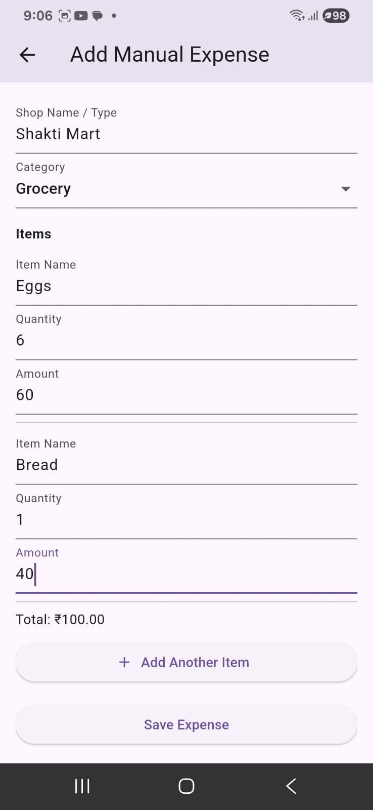

# 💸 Flutter Expense Tracker App

A simple yet powerful *Flutter app* to track your daily expenses manually or through scanned receipts. Built with SQLite for offline data storage and secure login using flutter_secure_storage.

---

## 🚀 Features

- ✅ Login / Create Account
- ✅ Secure credential storage using flutter_secure_storage
- ✅ Add expenses manually or via OCR-based receipt scanning
- ✅ Category-based dynamic input fields:
  - *Grocery, Food, Medical, Bills, Other* → Item Name, Quantity, Amount
  - *Travel* → Mode, Start, Destination, Amount
- ✅ Monthly expense summary and detailed transaction history
- ✅ Expenses shown in table format with item breakdown
- ✅ View previous months (dropdown)
- ✅ Export to PDF or Excel (planned)
- ✅ Chart-based monthly visualization (planned)

---

## 📱 Screenshots
### Home Page

### Add Manual Expense

### Expense Tracker

## 📦 Dependencies

yaml
dependencies:
  flutter:
  intl: ^0.18.1
  image_picker: ^1.0.2
  google_mlkit_text_recognition: ^0.10.0
  permission_handler: ^11.0.1
  flutter_secure_storage: ^9.0.0
  sqflite: ^2.3.0
  path_provider: ^2.1.2

lib/
├── main.dart
├── screens/
│   ├── login.dart
│   ├── register.dart
│   ├── add_manual_expense.dart
│   ├── add_receipt.dart
│   ├── expense_tracker.dart
├── helpers/
│   └── expense_database.dart

**How to Run**
flutter pub get
flutter run

**About the Developer**
Harshit Deepak Kadam
B.E. IT, Saraswati College of Engineering (Mumbai University)
👨‍💻 Worked on OCR-based post office identifier, employee attrition predictor, virtual drum, medicine app
📫 kadamharshit07@gmail.com
